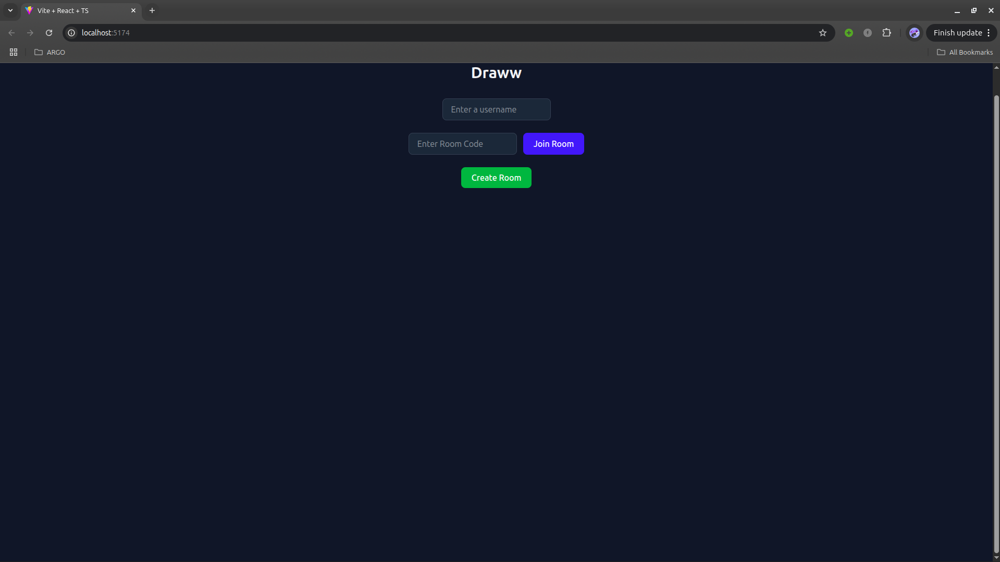
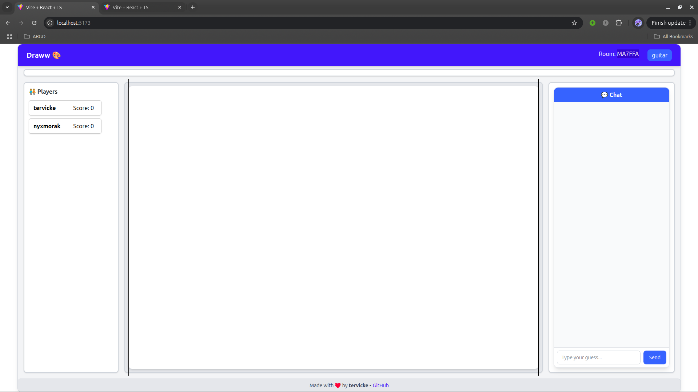
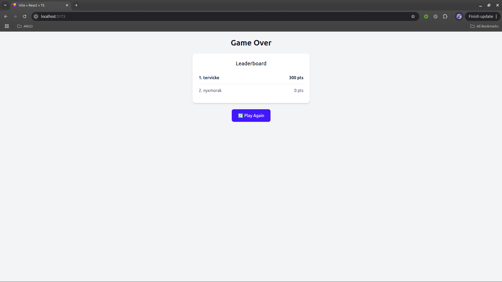

# draww

A skribble clone made with react and golang

| Project  | Description                 |
| -------- | --------------------------- |
| paneer   | old CRA frontend            |
| paneerv2 | vite react + ts frontend    |
| samosa   | gin + melody golang backend |

# screenshots

### TODO

- [ ] Unit tests
- [ ] add a waiting area ( + settings tab)
- [ ] Handle disconnects
- [ ] better UI
